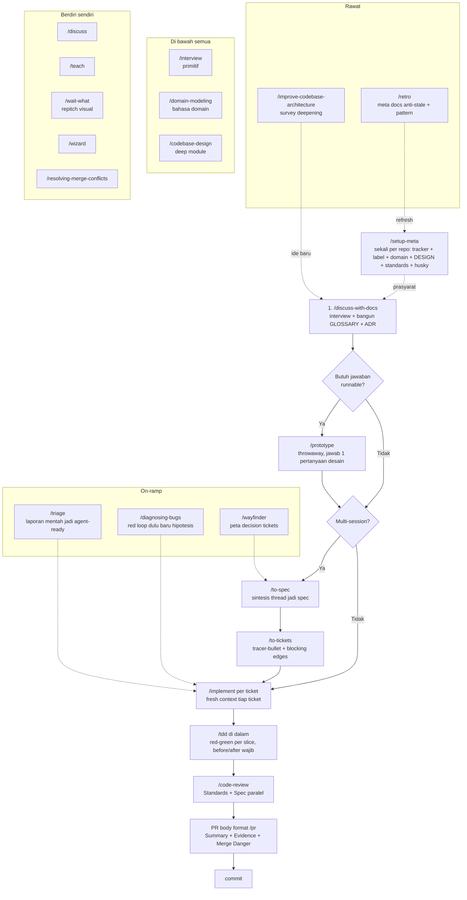

# Skills Flow

Peta skill repo ini: daftar + alur idea to ship.

## Daftar skill (28)

**User-invoked (15)**, diketik manual: guide, discuss, discuss-with-docs, implement, improve-codebase-architecture, loop-me, retro, setup-meta, setup-ts-deep-modules, teach, to-spec, to-tickets, triage, wait-what, wayfinder.

**Model-invoked (13)**, agent bisa panggil sendiri: codebase-design, code-review, diagnosing-bugs, domain-modeling, interview, pr, prototype, research, resolving-merge-conflicts, setup-pre-commit, tdd, wizard, writing-for-agents.

## Main flow: idea to ship

## Catatan

- `/handoff` dan `/to-questionnaire` sudah dihapus. Jembatan antar session pakai portable note tulisan tangan.
- `implement` satu pintu: pick spec/tiket, TDD before/after wajib, review wajib, PR format `pr`, commit.
- `setup-meta` gerbang gemuk: tracker + DESIGN + standards + husky.
- Context hygiene: grill sampai `to-tickets` satu window utuh; tiap `implement` mulai fresh.
