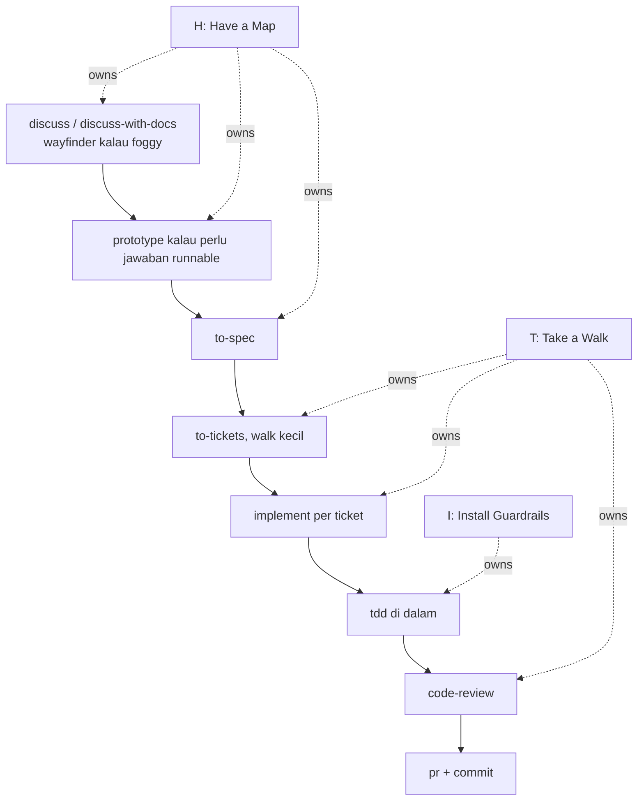
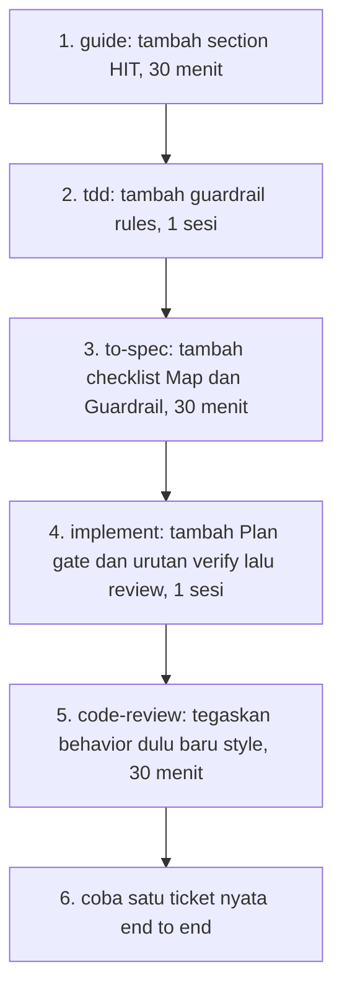

# HIT loop plan

Tujuan: pakai HIT sebagai bahasa untuk main flow yang sudah ada, lalu kunci tiga pintu itu di `guide`, `tdd`, dan `implement` tanpa menambah skill baru.

Sumber:
- [Principles Coding with AI](./references/Principles%20-%20Coding%20with%20AI.md)
- [guide](../skills/user-invoked/guide/SKILL.md)
- [tdd revision plan](./tdd-revision-plan.md)

## 1. Overlay: HIT di atas main flow sekarang

Main flow tetap sama, HIT hanya memberi nama untuk tiap fase dan pintu keluarnya.



Aturannya satu baris per fase: Map selesai sebelum Guardrail, Guardrail selesai sebelum Walk. Kalau ragu, balik ke fase pemiliknya.

## 2. Siapa pemilik apa

```text
skills/
├── user-invoked/
│   ├── discuss.md            # H: interview, pertajam ide
│   ├── discuss-with-docs.md  # H: interview plus GLOSSARY dan ADR
│   ├── wayfinder.md          # H: foggy effort, peta decision tickets
│   ├── prototype.md          # H: jawab satu pertanyaan desain, throwaway
│   ├── to-spec.md            # H ke I: bekukan map jadi spec
│   ├── to-tickets.md         # T: pecah jadi walk kecil plus blocking edges
│   ├── implement.md          # T: pemilik loop Plan, Coding, Review
│   └── guide.md              # router, tempat bahasa HIT tinggal
└── model-invoked/
    ├── tdd.md                # I: mesin red green, behavior bukan impl
    ├── code-review.md        # T: Standards plus Spec, behavior dulu baru style
    ├── diagnosing-bugs.md    # on-ramp: red loop dulu baru hipotesis
    └── triage.md             # on-ramp: issue mentah jadi agent ready
```

Tidak ada skill baru. Yang berubah hanya kontrak di tiga file: `guide`, `tdd`, `implement`, plus checklist kecil di `to-spec`.

## 3. Gate yang hilang sekarang

Pseudocode untuk pintu antar fase, ini yang perlu ditulis eksplisit di skill:

```text
on(start implement)
  if map is vague
    return to discuss-with-docs
  if guardrails missing
    return to tdd guardrail mode
  run walk

on(update test to fit wrong impl)
  block change
  ask user: impl salah atau ekspektasi berubah?

on(review)
  if guardrails fail
    fix behavior first
  else
    review quality: naming, query, race, complexity
```

## 4. Perubahan konkret per skill

### 4a. guide: tambah bahasa HIT, tanpa ubah routing

```diff
 Main flow: idea to ship
+  H (Have a Map): discuss, wayfinder, prototype, to-spec
+  I (Install Guardrails): tdd behavior plus negative cases
+  T (Take a Walk): to-tickets kecil, implement Plan Coding Review
   Context hygiene tetap sama
+  Phase boundaries: Continue, clear, portable note, subagent, compact
+  At boundary, tulis Map dan Guardrail yang dibawa ke fase berikut
```

Kenapa: router tetap sama, tapi user paham kenapa urutannya begitu dan kapan harus balik.

### 4b. tdd: dari mesin test jadi guardrail

Mengacu ke `tdd-revision-plan.md`, tambah tiga aturan HIT:

```diff
 tdd loop
   agree seams
+  list must happen, must never happen, failure cases
   write failing test
+  gate: fails for intended reason, undefined check
   smallest fix
+  forbid: jangan ubah test agar cocok dengan impl salah
+  negative cases wajib untuk business rule dan security
```

Bentuk slop yang ditolak tetap lima dari plan TDD: weak assertion, mock only, self referential, constant pin, fixture asserts fixture.

### 4c. implement: jadikan walk yang dikontrol

```diff
 implement per ticket
+  Plan Mode: baca ticket plus Map plus Guardrails, ajukan clarifying Q, minta approval
   Coding plus Tests: satu slice vertikal per siklus, before after wajib
+  Run guardrails dulu sebelum review style
+  Code Review: standar manusia, feedback berupa alasan bukan cuma fix
+  Keep walk small: satu ticket satu konteks segar, ticket besar dipecah lagi
```

Call tree sesudahnya:

```text
implement
  loadTicket
    readSpec
    readGuardrails
  planMode
    proposePlan
    awaitApproval
  codeLoop
    tddSlice
      failBefore
      passAfter
  verifyGuards
  codeReview
    standardsCheck
    specCheck
  prBody
```

## 5. Urutan eksekusi yang disarankan



Validasi tiap langkah:
- Link di `guide` tetap resolve ke skill yang ada.
- Kontrak before after di `implement` tidak berubah, hanya diperketat.
- Tidak ada user-invoked baru, jadi aturan router tidak rusak.
- Tanpa em dash di semua prose yang ditulis.

Langkah berikut: setuju dulu pada overlay section 1 dan pemilik section 2, baru draft revisi `guide` dulu karena itu yang paling murah.
