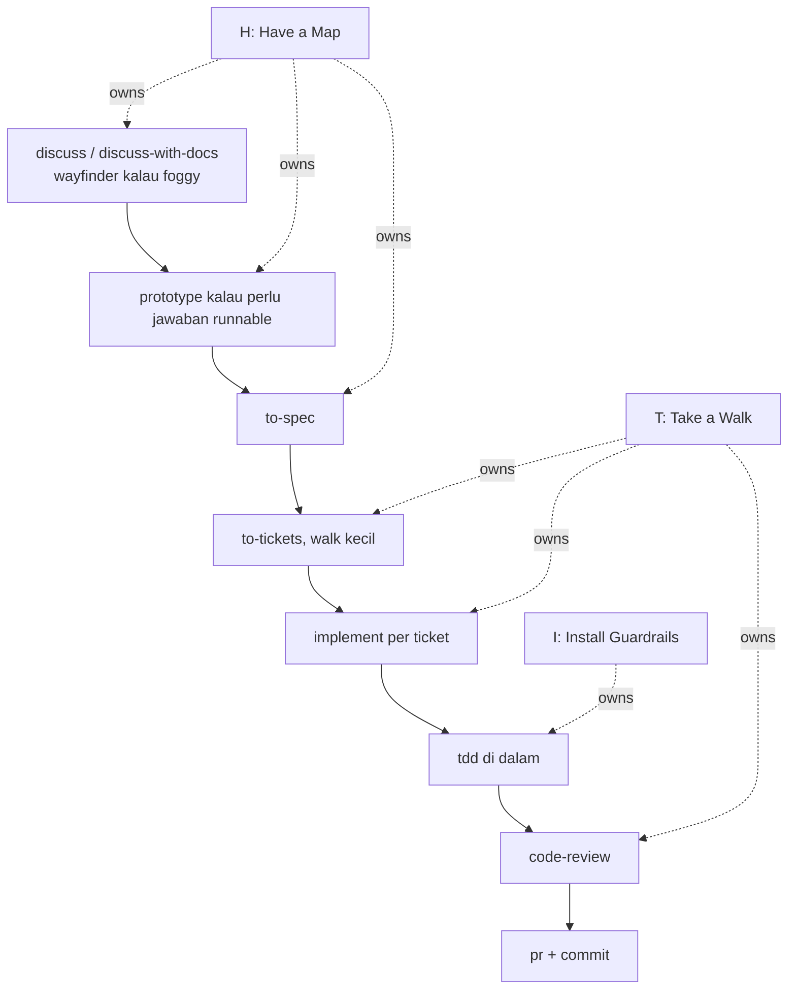
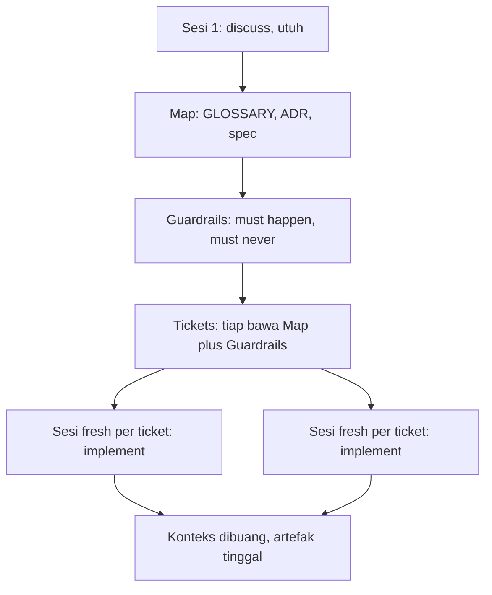
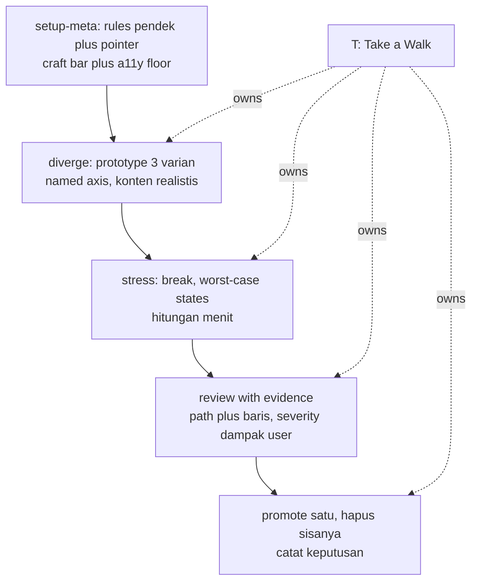
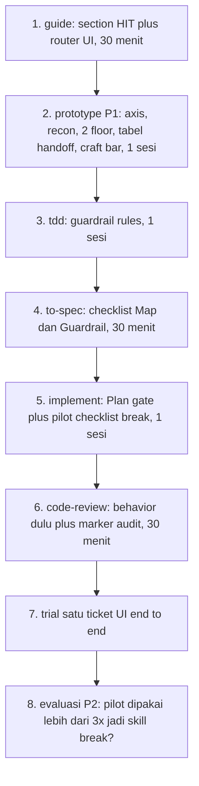

# HIT loop plan

Tujuan: pakai HIT sebagai bahasa untuk main flow yang sudah ada, lalu kunci tiga pintu itu di `guide`, `tdd`, dan `implement`. Tambahan ronde dua: sub-flow UI untuk ticket yang menyentuh interface (diverge, stress, review, promote) dari referensi Emil dan Jakub, plus upgrade P1 ke `prototype` lokal.

Keputusan user yang dicatat: `wait-what` versi visual dipertahankan, usulan ramping ke tiga baris ala upstream ditolak. Alasan: pain membaca teks, diagram dan flowchart plus diff lebih enak dibaca.


## 0. Master plan

File ini master plan tunggal. Detail desain di `ui-flow-design.md`, data di `references/`.

Status:
- DONE: langkah 1 (guide) sampai 6 (code-review). Langkah 7 (trial) dan 8 (evaluasi P2) DICORET atas permintaan user: fokus ke diagram dan cara kerja, bukan uji coba.
- DONE: bank 87 checklist fondasi (plus 17 mixed, 25 taste), desain UI flow, distilasi aihero, Emil, Jakub, checklist-design.
- TODO: 8 langkah eksekusi di section 7, mulai dari guide.
- PENDING: keputusan P2 (pilot checklist vs skill break baru). Craft bar DONE (`prototype/CRAFT.md`, floor plus taste, disetujui user).

Aturan main (dari user, berlaku untuk semua eksekusi):

- Straight-forward, tanpa emoticon. Label status audit pakai teks.
- Fondasi langsung di-fix, non-fondasi wajib konfirmasi.
- Standar di atas selera, tidak bisa dilonggarkan diam-diam.

Log keputusan:

- `wait-what` visual dipertahankan, usulan tiga baris ditolak.
- P1 prototype disetujui (axis, recon, dua floor, tabel handoff, craft bar).
- P2 break belum diputuskan, rekomendasi pilot checklist dulu.
Sumber:
- [Principles Coding with AI](./references/Principles%20-%20Coding%20with%20AI.md)
- [guide](../skills/user-invoked/guide/SKILL.md)
- [tdd revision plan](./tdd-revision-plan.md)
- [aihero vs lokal](./references/aihero-skills-diff.md)
- [Emil prototype distilled](./references/emil-prototype-skill.md)
- [Emil essays distilled](./references/emil-essays.md)
- [Jakub skills distilled](./references/jakub-skills-distilled.md)
- [Jakub writings distilled](./references/jakub-writings-distilled.md)

## 1. Overlay: HIT di atas main flow sekarang

Main flow tetap sama, HIT hanya memberi nama untuk tiap fase dan pintu keluarnya.



Aturannya satu baris per fase: Map selesai sebelum Guardrail, Guardrail selesai sebelum Walk. Kalau ragu, balik ke fase pemiliknya.

## Bagaimana konteks berjalan

HIT bukan cuma urutan kerja, ia juga aturan apa yang dibawa antar sesi. Map dan Guardrails adalah artefak portabel, konteks sesi sifatnya sekali pakai.



Aturannya: langkah 1 sampai 3 hidup dalam satu konteks utuh (jangan compact sebelum to-tickets), tiap implement mulai segar dari ticket, dan tidak ada agent yang diasumsikan ingat sesi sebelumnya. Yang diingat hanya yang tertulis.
## 2. Siapa pemilik apa

```text
skills/
├── user-invoked/
│   ├── discuss.md            # H: interview, pertajam ide
│   ├── discuss-with-docs.md  # H: interview plus GLOSSARY dan ADR
│   ├── wayfinder.md          # H: foggy effort, peta decision tickets
│   ├── prototype.md          # H: jawab satu pertanyaan desain, throwaway
│   ├── to-spec.md            # H ke I: bekukan map jadi spec
│   ├── to-tickets.md         # T: pecah jadi walk kecil plus blocking edges
│   ├── implement.md          # T: pemilik loop Plan, Coding, Review
│   └── guide.md              # router, tempat bahasa HIT tinggal
└── model-invoked/
    ├── tdd.md                # I: mesin red green, behavior bukan impl
    ├── code-review.md        # T: Standards plus Spec, behavior dulu baru style
    ├── diagnosing-bugs.md    # on-ramp: red loop dulu baru hipotesis
    └── triage.md             # on-ramp: issue mentah jadi agent ready
```

Skill baru hanya kalau P2 disetujui (lihat section 6). Selain itu yang berubah hanya kontrak file yang ada.

## 3. Gate yang hilang sekarang

Pseudocode untuk pintu antar fase, ini yang perlu ditulis eksplisit di skill:

```text
on(start implement)
  if map is vague
    return to discuss-with-docs
  if guardrails missing
    return to tdd guardrail mode
  run walk

on(update test to fit wrong impl)
  block change
  ask user: impl salah atau ekspektasi berubah?

on(review)
  if guardrails fail
    fix behavior first
  else
    review quality: naming, query, race, complexity
```

## 4. Perubahan konkret per skill

### 4a. guide: tambah bahasa HIT, tanpa ubah routing

```diff
 Main flow: idea to ship
+  H (Have a Map): discuss, wayfinder, prototype, to-spec
+  I (Install Guardrails): tdd behavior plus negative cases
+  T (Take a Walk): to-tickets kecil, implement Plan Coding Review
   Context hygiene tetap sama
+  Phase boundaries: Continue, clear, portable note, subagent, compact
+  At boundary, tulis Map dan Guardrail yang dibawa ke fase berikut
```

Kenapa: router tetap sama, tapi user paham kenapa urutannya begitu dan kapan harus balik.

### 4b. tdd: dari mesin test jadi guardrail

Mengacu ke `tdd-revision-plan.md`, tambah tiga aturan HIT:

```diff
 tdd loop
   agree seams
+  list must happen, must never happen, failure cases
   write failing test
+  gate: fails for intended reason, undefined check
   smallest fix
+  forbid: jangan ubah test agar cocok dengan impl salah
+  negative cases wajib untuk business rule dan security
```

Bentuk slop yang ditolak tetap lima dari plan TDD: weak assertion, mock only, self referential, constant pin, fixture asserts fixture.

### 4c. implement: jadikan walk yang dikontrol

```diff
 implement per ticket
+  Plan Mode: baca ticket plus Map plus Guardrails, ajukan clarifying Q, minta approval
   Coding plus Tests: satu slice vertikal per siklus, before after wajib
+  Run guardrails dulu sebelum review style
+  Code Review: standar manusia, feedback berupa alasan bukan cuma fix
+  Keep walk small: satu ticket satu konteks segar, ticket besar dipecah lagi
```

Call tree sesudahnya:

```text
implement
  loadTicket
    readSpec
    readGuardrails
  planMode
    proposePlan
    awaitApproval
  codeLoop
    tddSlice
      failBefore
      passAfter
  verifyGuards
  codeReview
    standardsCheck
    specCheck
  prBody
```

### 4d. prototype UI: P1, lima tambahan kecil (disetujui)

Sumber pola: Emil (named axis, tabel tradeoff, craft bar) dan Jakub (floor a11y sebagai syarat masuk, satu primary axis).

```diff
 UI.md process
   state the question and pick N
+  name one primary axis + position per variant, no two share a position
+  recon tiga baris: tokens, density dan voice produk, konteks render
   generate radically different variants
+  every variant clears a11y floor before entering picker
   wire them plus floating switcher
   hand it over
+  handoff table: variant, axis position, right when, costs; no favorite marked
+  craft bar: tunjuk skill taste yang berlaku, varian sloppy tidak melebarkan eksplorasi
```

Yang dipertahankan: `?variant=` switcher, sub-shape A (embed di halaman yang sudah ada) sebagai default, cabang logic single HTML.

## 5. Sub-flow UI: menempel di fase Walk

Hanya untuk ticket yang menyentuh interface. Ticket non-UI lewat Walk biasa.



Kenapa urutannya ini: diverge tanpa stress menghasilkan varian cantik yang rapuh, stress tanpa review menghasilkan temuan tanpa severity, review tanpa promote menimbun opsi. Friction di ujung (pilih satu, hapus sisanya) adalah filternya.

## 6. P2: evaluasi skill break (belum diputuskan)

Apa itu: skill Jakub yang me-render satu komponen di halaman sementara dalam semua state dan skenario yang bisa mencapainya. Deliverable-nya halaman itu sendiri. Skenario disimpulkan dari props dan state komponen, yang tidak cocok di-drop dengan alasan satu baris. Satu run hitungan menit, bukan sesi.

Validasi eksternal: Emil Kowalski (25 Sep 2026) memakai pola yang sama, minta AI mem-break UI yang ia bangun dengan data banyak, nama panjang, email tidak biasa, label aneh, alias worst-case scenario, lalu mematangkan UI dari situ. Ini guardrail untuk UI dalam arti harfiah: bukan test merah hijau, tapi skenario konten yang harus ditahan.
Implikasinya floor UI ada dua lapis: floor a11y (keyboard, fokus, kontras, 320px) dan floor konten (nama panjang, data kosong, data massal, string aneh). Varian yang cantik tapi jebol di floor konten sama gagalnya dengan yang jebol a11y.
Opsi adopsi:

```text
A: skill model-invoked baru
  plus:  paling murah dari semua kandidat skill baru, reuse pola prototype harness
  minus: nambah satu file skill untuk dirawat, aturan invocation baru
B: checklist 5 baris di implement untuk ticket UI
  plus:  tanpa skill baru, langsung kepakai besok
  minus: mudah di-skip karena bukan skill yang bisa dipanggil
C: tunda sampai P1 prototype terbukti dipakai
  plus:  tidak nambah beban sebelum kebiasaan diverge terbentuk
  minus: varian tetap lolos tanpa stress test untuk sementara
```

Rekomendasi: B dulu sebagai pilot (checklist di `implement`), naik ke A kalau dipakai lebih dari tiga kali. Keputusan di tangan user.

## 7. Urutan eksekusi yang disarankan



Validasi tiap langkah:
- Link di `guide` tetap resolve ke skill yang ada.
- Kontrak before after di `implement` tidak berubah, hanya diperketat.
- Tidak ada user-invoked baru (P2 opsi A pun model-invoked), jadi aturan router tidak rusak.
- Tanpa em dash di semua prose yang ditulis.

Yang ditolak dan tidak dikerjakan: ramping `wait-what` ke tiga baris ala upstream. Versi visual dipertahankan.

Sudah selesai sebelum eksekusi: bank 87 checklist fondasi (references/checklist-design) dan desain UI flow (ui-flow-design.md). Langkah berikut: kerjakan nomor 1 dulu karena paling murah, lalu nomor 2 yang sudah disetujui.
