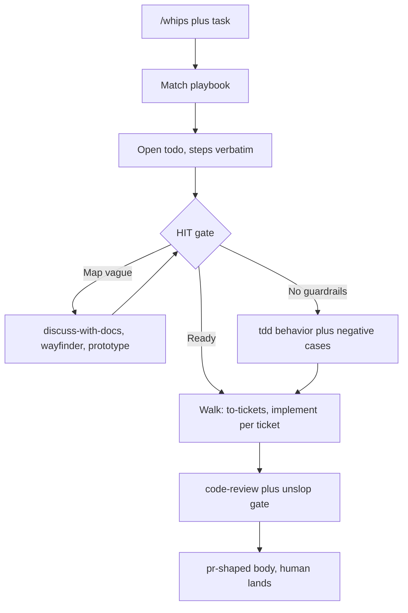
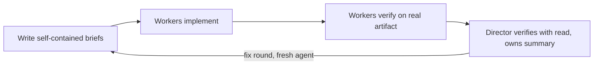
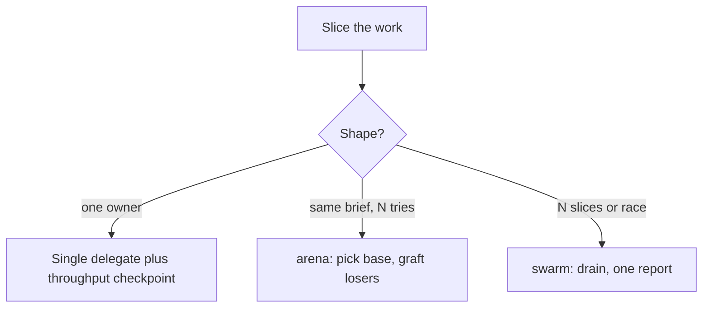

# Plan: SFA stack playbook router (poteto style, vibe compatible)

Goal: one user invoked entry that routes our HIT skills without micromanagement, patterned on Poteto `poteto-mode`, runnable under OMP vibe mode and plain pi/Codex/agy.

## Context (researched)

- OMP vibe mode: director plus keep alive worker subagents. Director shrinks to `read` plus `vibe_spawn`, `vibe_send`, `vibe_wait`, `vibe_kill`, `vibe_list`. Workers are blank slate, briefs must be self contained. Director verifies with `read` and owns the summary. No autonomous continuation without Goal mode. Sources: `docs/vibe-mode.md`, `packages/coding-agent/src/vibe/runtime.ts`, `packages/coding-agent/src/prompts/system/vibe-mode-active.md`, issues 5674, 5630, 6487, 11005, 9654, 5317, 8171, 11123, 10121, 7963.
- OMP advisor plus hooks: advisor is an async reviewer model with nit, concern, blocker, preserve channels and weigh-dont-obey guidance. Steering races the turn end (syncBacklog default off, steer only while streaming, vibe_send gives steered, queued, or turn with no landing guarantee). Enforceable gates are hooks: tool_call block, agent_end and turn_end checks, fail closed. Sources: `docs/advisor-watchdog.md`, `docs/hooks.md`, `packages/coding-agent/src/advisor/`, `packages/coding-agent/src/extensibility/hooks/`, issues 5628, 4840, 9745.
- Poteto pstack: `cursor/plugins`, folder `pstack`. Entry `/poteto-mode` matches task to 1 of 23 playbooks, opens todo with steps verbatim, routes to skills as steps fire, delegates implementation to fresh subagents with consolidated scope, director reviews diff and writes own summary. Key files: `pstack/skills/poteto-mode/SKILL.md`, `pstack/skills/swarm/SKILL.md`, `pstack/skills/poteto-mode/playbooks/feature.md`, `pstack/skills/poteto-mode/playbooks/orchestrate.md`.

## Routed skills inventory (what makes pstack overpowered)

The router is thin. The power is what it routes to. Each row names the pstack capability, what it does, and where our repo stands. Sources: `pstack/skills/poteto-mode/SKILL.md`, plus the leaf skills `how`, `why`, `architect`, `arena`, `interrogate`, `figure-it-out`, `swarm`, `unslop`, `reflect`, `show-me-your-work`, `blast-radius`.

- Have: `/tdd` matches pstack `tdd`, `/teach` matches `teach`, `/research` covers the reading leg of `how` and `why`, `/diagnose` covers the reproduce plus root cause leg of bug fix, `/code-review` covers single model review (pstack `interrogate` adds multi model panels plus lead judgment with Act, Consider, Noted, Dismissed), `/retro` covers the session learning leg of `reflect` and `correct` (pstack routes learnings into skill edits with user approval).
- Adapt (partial, needs a playbook step not a new skill): `how` (parallel explorer subagents plus a synthesizer for a working mental model before changing code), `why` (lineage across git plus tickets plus docs plus chat plus observability with confidence tiers, ending in Preserve, Change, Avoid, Risk constraints for the change), `architect` (ground via how plus why, sketch at least two candidates, agree, implement against the sketch, scrap signals when friction repeats), `blast-radius` (one safety fact proven by running code, never a writeup), `show-me-your-work` (append only TSV decision trail plus cross model review for unattended runs), `benchmark-checklist` (vet a measured number before reporting or acting on it).
- Build new (gap, small model invoked rules or playbooks): `arena` (N parallel candidates, cross judge on a rubric, pick a base, graft the best of the losers), `swarm` (N parallel workers across slices or races, one aggregated report), `unslop` (numbered prose and comment rules applied before review and PR), `no-comments` (strip comments before review), `technical-writing` (doc standard for RFCs and readmes), `babysit` plus `shipping` (drive a PR to green, verify each head SHA, land the contiguous verified run), `figure-it-out` (design a bespoke rigorous playbook when no playbook fits), `recall` (rebuild context from history on resume), per role model mapping (like setup-pstack, extends `/setup-meta`).
- Defer: `orchestrate` plus `autopilot` program scale coordination, `automate-me` personal mode mining, platform specific runners. Revisit after `/whips` proves itself on single efforts.

## Design

New user invoked skill `/whips`. Decision made (see Open questions).

Behavior:
1. Match task to one playbook (small set, reuse existing skills):
   - investigation: `/research` then `/discuss-with-docs`
   - bug: `/diagnose` then `/tdd` then `/code-review`
   - feature: `/discuss-with-docs`, optional `/prototype` on empirical fork, `/to-spec`, `/to-tickets`, `/implement` per ticket (implement already drives `/tdd` plus `/code-review`)
   - UI ticket: feature path plus diverge (`/prototype` variants), guard (a11y plus content), stress (`/break`), evidence review
   - foggy multi session: `/wayfinder`, merge at `/to-spec`, never straight to `/implement`
   - upkeep: `/deepen` survey, design on `/codebase-design` bench
2. Open todo with playbook steps verbatim. Skipped step stays with `skip: <reason>`.
3. Drive model invoked skills plus subagents itself. Human decides only at forks (approach, guardrail approval, ticket boundaries). This keeps HIT gates (Map before Guardrails, Guardrails before Walk) while removing per skill typing.
4. Subagent brief rule (vibe safe): every delegate gets GOAL, SCOPE paths, CONTEXT pointers, ACCEPTANCE, VERIFY command, REPORT shape. Fresh agent per round with consolidated scope. No resume chains. Director verifies with `read`, reviews diff, writes own summary.
5. Harness mapping: on OMP use `vibe_spawn`/`vibe_send`/`vibe_wait`; elsewhere use background Agent. Decided: separate `VIBE-MAPPING.md` reference (see Open questions). SKILL.md points at it.

## Flow

Router loop (one entry, HIT gates stay, typing goes away):

Director plus workers (same shape on OMP vibe and on plain background agents):

Fan out choice (parent level only for independent artifacts, else one owner with checkpoint inline):

## Usecases (from pstack, mapped to /whips)

Sources: `pstack/docs/guide/07-overnight.md`, `pstack/skills/poteto-mode/playbooks/autonomous-run.md`, `autopilot-full.md`, `autopilot-stack.md`, `orchestrate.md`.

1. Overnight migration (one task, one finish condition). Handoff has goal, falsifiable done predicate, fresh worktree, decision log, no permission blocks, `/loop` until done, escape hatch to stop and write up why. Morning audit reads the decision log plus the cross model Attention section, not the whole night. Maps to `/whips` feature or bug playbook plus `show-me-your-work` trail.
2. Queue to merged by morning (independent PRs). Each PR gets one owner from build to merge, a verifier swarm checks every code ready head, only a clean verdict on the merged patch authorizes the merge. Coupled changes use the stack variant instead: one linear stack with a verdict per link, human lands it. Maps to `/whips` plus the `babysit` plus `shipping` build new items.
3. Program that outlives any single agent (multi day, many stacked PRs). One standing coordinator owns briefs, queue drains, and a green frontier, never code. Human checks in twice a day. Deferred in our inventory until `/whips` proves itself on single efforts.
4. Throughput reference (verified, corrects the 2000 figure). Lauren Tan merged about 1000 PRs in a month at Cursor, with nearly 800 in the first 12 days of the next month, which is the pace the 2000 number likely came from. Sources: UninformedInvestors interview (https://www.youtube.com/watch?v=Zc07HI9Ppxk), Matt Pocock livestream on shipping 1000s of PRs a month (https://www.youtube.com/watch?v=MN9dGgmLyso), team shape quote of 15 plus agents with chief of staff, managers, workers (https://www.youtube.com/watch?v=PaPpyQocMww). The mechanism is usecases 2 and 3 in parallel: many owners, verifier swarms per push, landing continuous instead of terminal. Lesson for us: verification is the bottleneck, so plan high parallel small units with mandatory independent verification rather than raw agent count.

## Automations (benny equivalent for /whips plus vibe)

Benny shape (source: `pstack/automations/benny/FOR_AGENTS.md`): two automations, triage issue reports (classify, dedupe against tracker, ticket only net new bugs) then reproduce and fix (repro twice through the real UI with screenshots plus video, one bounded root cause fix, draft PR only). Both fail closed on missing config, draft PRs only, never merge, never post root messages, config lives outside the pack so refreshes cannot overwrite it.

/whips equivalent on vibe mode: auto pick issues (triage into agent ready tickets per `/triage` roles, dedupe first) then worker (implement plus verify plus PR with evidence) then audit gate (review plus unslop plus attachments check) before a human ever looks. Draft PRs only, never merge, never self add as collaborator, assignee, or reviewer. Tools are not people.

PR evidence gate (the pain you named): the PR body IS the review surface when you cannot review live. Every visible change needs the before and after pair in a table at native 1x with matched viewport and crop, video when motion matters, never inside `
` (source: our `pr` skill `ATTACHMENTS.md`). The worker REPORT must carry proof pointers (commit SHAs, screenshot paths, video path, verify commands with output). The audit rejects evidence free PRs as NOT VERIFIED and respawns a fix round with a fresh agent. A green CI alone is not a verdict.

Steer race (main agent stops before advisor steer lands): verified against OMP source, and the race is real. The advisor is an optional reviewer model that injects `<advisory severity=...>` into primary context with weigh-dont-obey guidance. It never approves actions or mutates state (sources: `docs/advisor-watchdog.md`, `packages/coding-agent/src/advisor/runtime.ts`, `advise-tool.ts`, `emission-guard.ts`, `session/session-advisors.ts`). Delivery channels: `nit` lands at the next boundary, `concern` or `blocker` interrupts a streaming turn, `preserve` shows a card with no wake (late terminal answers, plan mode, cooldowns). Reported races: blocker ignored until next turn (issue 5628), duplicate final answers after advisor continuations (issue 4840), stale review trapping the drain while primary sits idle (issue 9745, open). Causes: the advisor runs async, the primary only waits when `advisor.syncBacklog` is set (default off), and `steer()` only steers while streaming. Same for `vibe_send`: streaming gets `steered` at the next step, non streaming gets `queued`, idle starts a `turn`. No guarantee a directive lands before finish (sources: `docs/vibe-mode.md`, `packages/coding-agent/src/vibe/runtime.ts`, `tools/vibe.ts`). So the rule stands: never rely on mid turn steering. Steer inline in briefs plus standing orders, drain at boundaries. The enforceable gate is OMP hooks (source: `docs/hooks.md`): `tool_call` pre-exec blocks a report-done or submit without PR evidence, `agent_end` or `turn_end` plus `tool_result` demands proof, and hooks fail closed. VIBE-MAPPING.md carries the severity table plus the hook gate recipe.

Scope note: the automation pack itself is walk phase, after the skill proves itself. Map stays skill plus VIBE-MAPPING.md plus 2 playbooks.

## Files to change

- New: `skills/user-invoked/whips/SKILL.md` (frontmatter `disable-model-invocation: true`, plus `policy.allow_implicit_invocation: false` in `agents/openai.yaml`)
- New: `skills/user-invoked/whips/VIBE-MAPPING.md` (reference per `writing-for-agents`, OMP director plus worker rules, advisor severity table, hooks evidence gate recipe, agents must read and follow it)
- New: `skills/user-invoked/whips/playbooks/*.md` (6 to 8 files, one per playbook above)
- New: `skills/user-invoked/whips/CREDITS.md` (credit Poteto pstack, OMP vibe docs)
- New: `skills/user-invoked/whips/agents/openai.yaml`
- Edit: `skills/user-invoked/guide/SKILL.md` (router must mention new skill, per repo router rule)
- Edit: top `README.md` (add skill row with link, per repo rule)
- Edit: `skills/user-invoked/README.md` (add one line row)
- Maybe: `.changeset/<name>.md` if repo convention wants one per user invoked skill change

## Conventions to respect

- No em dashes anywhere in prose, code comments, changesets. Rewrite with comma, colon, period, parentheses.
- Install block wording copied verbatim from `.agents/install-block.md` where install is mentioned.
- `guide` stays accurate: new skill mentioned, flows updated.
- `agents/openai.yaml` per skill carries invocation flags.
- Unslop gate like Poteto: short declarative sentences, no AI tells, no filler or phase narrating comments, keep only why comments the code cannot show. Ship it as a model invoked rule the router calls before review and before PR.
- PR body follows this repo `pr` skill shape (summary visual, before and after evidence, merge danger). Agents never add themselves as collaborator, assignee, or reviewer on GitHub. Tools are not people, so they only author the body and request review from humans.

## Steps

1. Review the routed skills inventory and confirm the adapt vs build new split (name `/whips` and `VIBE-MAPPING.md` reference already decided). DONE when user confirms.
2. Scaffold `skills/user-invoked/whips/` with SKILL.md plus VIBE-MAPPING.md plus 2 starter playbooks (feature, bug). DONE when files exist and READMEs plus guide updated.
3. Add remaining playbooks (investigation, UI variant, wayfinder handoff, upkeep). DONE when each playbook has steps plus owning skills.
4. Dry run on a real task in this repo. DONE when director plus worker flow produces verified diff with evidence.
5. OMP vibe pass. DONE when same playbook runs under `/vibe` with `vibe_*` tools and read only verification.

## Open questions

- Name: decided, `/whips` (from Indonesian pecut, whip, the director drives the workers). Folder `skills/user-invoked/whips/`. answer : YES
- Vibe mapping: decided, use a reference file (`VIBE-MAPPING.md`) written per `writing-for-agents`, not an inline section. The router SKILL.md points at it and agents must read and follow it on every OMP run (director stays read only, workers get self contained briefs, verify with read). answer : YES
- Scope cut: map first before walk. Map is this inventory plus the router map plus SKILL.md plus VIBE-MAPPING.md plus 2 playbooks (feature, bug). Walk is the adapt items first, then the build new items, then the remaining playbooks (investigation, UI variant, wayfinder handoff, upkeep). answer : YES
- Map review: this document is the map. Walk (scaffold) starts after your approval of the inventory split plus the Automations section.

## Report back

After scaffold, report: files created, guide diff, dry run evidence, what is still TODO.
