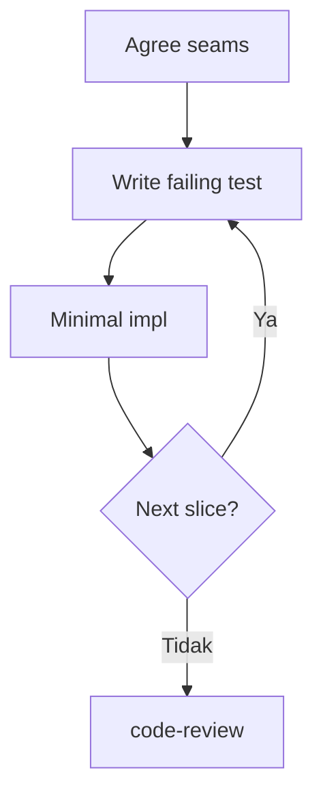
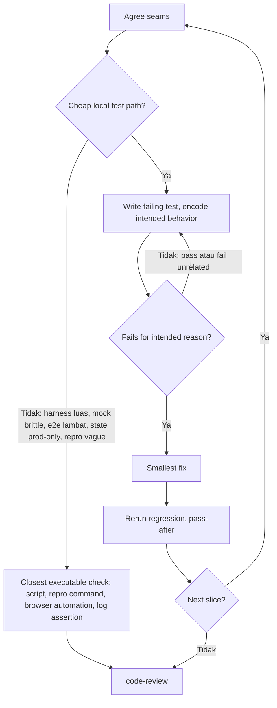
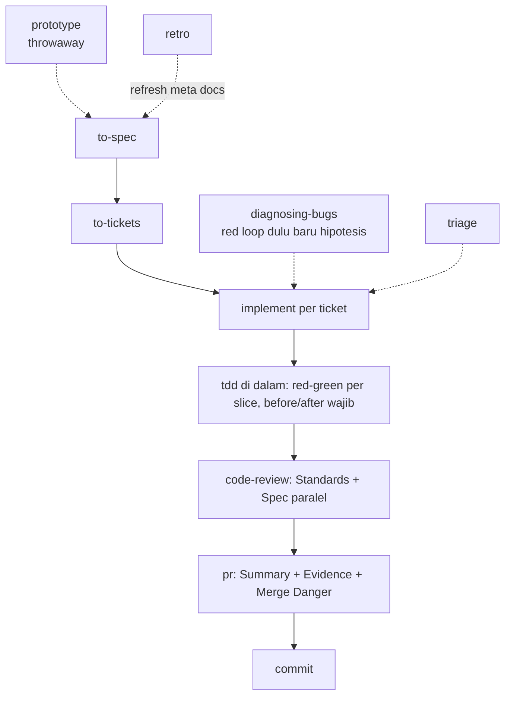

# TDD revision plan from pstack teardown

Tujuan: perbaiki `skills/model-invoked/tdd` supaya tidak lagi menghasilkan slop test, dengan mencuri senjata operasional dari `pstack` tanpa mengganti filosofi seam dan vertical slice kita.

Sumber acuan lokal:

- [tdd SKILL](../skills/model-invoked/tdd/SKILL.md)
- [tdd tests](../skills/model-invoked/tdd/tests.md)
- [tdd mocking](../skills/model-invoked/tdd/mocking.md)
- [implement SKILL](../skills/user-invoked/implement/SKILL.md)
- [flow map](./flow.md)
- [pstack tdd](./references/plugins/pstack/skills/tdd/SKILL.md)
- [pstack principle test behavior](./references/plugins/pstack/skills/principle-test-behavior-not-implementation/SKILL.md)

## 1. Diagram: loop sekarang vs loop usulan

### 1a. Loop sekarang



Masalah: tidak ada pintu keluar. AI dipaksa bikin test walau path mahal, mock brittle, atau repro tidak jelas.

### 1b. Loop usulan, dengan exit clause ala pstack



Bedanya cuma dua node baru (`C` dan `V`) plus satu gate (`F`), tapi itu yang menghentikan sebagian besar slop.

## 2. Before after: lima bentuk slop dan expected fix

Check utama yang dicuri dari pstack: kalau semua function yang di-import return `undefined` tapi test tetap pass, test itu tidak mengobservasi behavior. Rewrite atau delete.

### 2.1 Weak assertion

Before:

```typescript
test("checkout works", async () => {
  const result = await checkout(cart, payment);
  expect(result).toBeDefined();
});
```

After, expected:

```typescript
test("user can checkout with valid cart", async () => {
  const cart = createCart();
  cart.add({ price: 10 });
  const result = await checkout(cart, validPayment);
  expect(result.status).toBe("confirmed");
});
```

Kenapa: `toBeDefined` lolos walau subject return `{}` atau `undefined` dibungkus. Assert literal yang diobservasi user.

### 2.2 Mock only

Before:

```typescript
test("checkout calls paymentService.process", async () => {
  const mockPayment = jest.mock(paymentService);
  await checkout(cart, payment);
  expect(mockPayment.process).toHaveBeenCalledWith(cart.total);
});
```

After, expected:

```typescript
test("user can checkout with valid cart", async () => {
  const cart = createCart();
  cart.add({ price: 10 });
  const charges: number[] = [];
  const fakePayment = { charge: async (n: number) => { charges.push(n); return "ok"; } };
  const result = await checkout(cart, fakePayment);
  expect(result.status).toBe("confirmed");
  expect(charges).toEqual([10]);
});
```

Kenapa: assert payload dan state setelah call, bukan bahwa mock dipanggil. Mock hanya di system boundary dengan DI.

### 2.3 Self referential, alias tautological

Before:

```typescript
test("calculateTotal sums line items", () => {
  const items = [{ price: 10 }, { price: 5 }];
  const expected = items.reduce((sum, i) => sum + i.price, 0);
  expect(calculateTotal(items)).toBe(expected);
});
```

After, expected:

```typescript
test("calculateTotal sums line items", () => {
  expect(calculateTotal([{ price: 10 }, { price: 5 }])).toBe(15);
});
```

Kenapa: expected harus literal independen dari spec atau worked example, bukan dihitung ulang dengan cara yang sama seperti kode.

### 2.4 Constant pin, pola baru yang belum ada di skill kita

Before:

```typescript
test("limits config", () => {
  expect(LIMITS.maxTools).toBe(8);
  expect(PROMPT).toContain("You are");
});
```

After, expected: hapus test itu, ganti dengan test mekanisme yang membaca konstanta:

```typescript
test("tool runner respects maxTools", async () => {
  const result = await runTools(fakeTools(10), { maxTools: 2 });
  expect(result.executed).toHaveLength(2);
});
```

Kenapa: constant pin gagal saat seseorang edit konstanta atau prompt yang sah, tapi tidak menangkap defect apa pun. Kecuali relasi antar row tabel atau compile-time check `*.test-d.ts`, pola ini dihapus.

### 2.5 Fixture asserts fixture

Before:

```typescript
describe("createUser", () => {
  let seed;
  beforeEach(() => { seed = { name: "Alice" }; });
  test("creates user", async () => {
    expect(seed.name).toBe("Alice");
  });
});
```

After, expected:

```typescript
test("createUser makes user retrievable", async () => {
  const user = await createUser({ name: "Alice" });
  const retrieved = await getUser(user.id);
  expect(retrieved.name).toBe("Alice");
});
```

Kenapa: subject harus jalan di dalam body test dengan satu input konkret, dan assertion membaca output atau observable effect-nya.

## 3. Flow dengan skills kita

tdd bukan skill berdiri sendiri. Dia satu node di flow idea to ship.



Peran masing masing:

- `implement`: pemilik loop. Step 2-nya mewajibkan TDD di pre-agreed seam, satu vertical slice per siklus, tiap slice pasangan before/after. Tanpa ini tdd jadi opsional.
- `tdd`: mesin red green. Yang perlu ditambah dari pstack adalah exit clause, undefined check, constant pin, guardrails anti pelemahan assertion, dan final response berbasis evidence.
- `code-review`: refactoring bukan bagian dari loop. Review yang menangkap seam tak disepakati, fixture churn luas, dan coverage expansion yang tidak diminta.
- `pr`: before/after pairs dari TDD menjadi section Evidence hampir verbatim. Kalau TDD slop, Evidence ikut slop.
- `diagnosing-bugs`: untuk bugfix, dia yang memutuskan apakah ada cheap local test path. Kalau tidak ada, dia tidak memaksa tdd.
- `prototype`: untuk pertanyaan desain, jangan pakai tdd. Prototype itu throwaway untuk menjawab satu pertanyaan, bukan untuk dikunci jadi regression test.

## 4. Plan revisi konkret

Ubah tiga file, tambah satu bagian, tanpa ubah filosofi seam:

1. `skills/model-invoked/tdd/SKILL.md`
   - Tambah bagian When to skip: harness luas, mock brittle, e2e lambat, production-only state, repro vague, fixture churn besar. Ganti dengan closest executable check.
   - Tambah undefined check sebagai gate sebelum keep test.
   - Tambah constant pin sebagai anti-pattern ketiga.
   - Tambah guardrails: jangan ubah test agar cocok dengan implementasi salah, jangan lemahkan assertion kecuali behavior memang berubah, keep focused, flaky dibuat deterministik plus dokumentasi sinyal.
   - Tambah final response: wajib lapor failing-before plus failure-nya, passing-after plus validasi sekitar, atau alasan kenapa tidak bisa plus check pengganti.

2. `skills/model-invoked/tdd/tests.md`
   - Ganti dua contoh abstrak dengan lima contoh before after dari section 2 di atas.
   - Tiap contoh diberi label bentuk slop-nya supaya reviewer AI bisa cite.

3. `skills/model-invoked/tdd/mocking.md`
   - Tambah aturan assert: untuk mock, assert payload atau state setelah call, bukan call-nya.
   - Pertahankan DI dan SDK-style interface yang sudah ada.

4. Validasi
   - Link balik dari `implement` tetap sah karena kontrak before/after tidak berubah, hanya diperketat.
   - Update `guide` hanya kalau trigger tdd berubah. Kalau trigger tetap luas, tidak perlu sentuh router.

Langkah berikut yang disarankan: setuju dulu pada lima contoh di section 2, baru aku draft revisi SKILL.md-nya.
