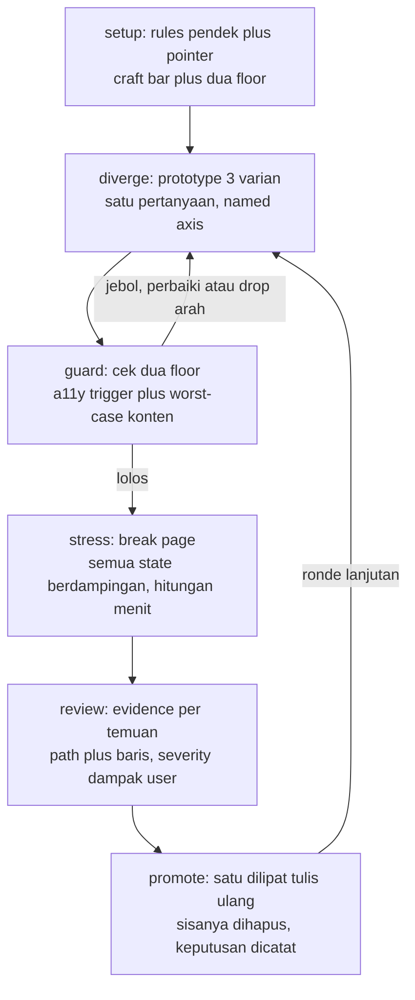

# Desain UI flow dengan AI

Status: desain untuk disetujui, belum dieksekusi. Sumber temuan: `hit-loop-plan.md` plus distilasi di `references/`.

## Tiga prinsip yang dipegang

1. Diverge dulu, nilai belakangan. Tiga varian yang beda jawaban, bukan beda tint.
2. Guardrail dua lapis sebelum handoff: floor a11y dan floor konten. Varian cantik yang jebol salah satunya bukan kandidat.
3. Friction di ujung: pilih satu, hapus sisanya, catat kenapa. Opsi yang tidak pernah dipilih adalah timbunan, bukan eksplorasi.

## Alur end to end



Alur ini menempel di fase Walk pada ticket yang menyentuh interface. Ticket non-UI lewat Walk biasa tanpa sub-flow ini.

## Lima gate dan pemiliknya

| Gate | Pemilik | Lolos jika | Gagal maka |
| --- | --- | --- | --- |
| G1 axis bernama | prototype | tiap varian punya nama plus posisi satu primary axis, tidak ada yang berbagi | pindah satu varian ke axis lain, atau potong |
| G2 floor a11y | prototype | trigger Jakub clear: nama aksesibel, keyboard penuh, fokus terlihat, tidak clip 320px, makna tidak dibawa warna saja | perbaiki, atau drop arah dan nyatakan |
| G3 floor konten | prototype | daftar worst-case di bawah ditahan semua | perbaiki, atau drop arah dan nyatakan |
| G4 evidence review | code-review | tiap temuan menunjuk path dan baris, severity dari dampak ke user, trigger selalu HIGH | kembalikan ke implement, bukan lanjut ke pr |
| G5 promote | implement | satu varian dilipat dengan tulis ulang yang benar, sisanya dihapus, keputusan dicatat | tidak boleh merge harness ke main |

## Floor konten starter untuk UI penampil data

Dipakai di G3, dibaca sebagai checklist bukan test otomatis:

```text
data-floor/
├── text-extreme.md     # nama dan label terpanjang yang masuk akal, plus satu yang tidak
├── weird-strings.md    # email panjang, CJK, Arab, emoji di nama
├── volume.md           # 3 baris lawan 1000 baris, pagination atau virtualisasi ikut diuji
├── empty-partial.md    # empty state, satu field null, avatar hilang, harga nol
├── narrow.md           # 320px dan zoom 200 persen, tabel yang kolomnya tidak muat
└── mixed-states.md     # loading plus error plus sukses dalam satu halaman
```

Aturan mainnya sama dengan guardrail TDD: agent tidak boleh melonggarkan daftar ini diam diam. Kalau satu skenario dinilai terlalu berat, yang memutuskan tetap user.

## Artefak tiap fase

```text
ticket-ui/
├── brief.md            # satu kalimat: apa, di mana render, harus apa
├── variants.md         # nama plus axis tiap varian, link picker ?variant=
├── floor-check.md      # centang G2 dan G3 per varian, yang jebol ditandai
├── break-page.md       # link halaman stress plus daftar yang visibly broke
├── review.md           # tabel temuan plus severity, trigger didahulukan
└── decision.md         # pemenang, kenapa, apa yang dibuang
```

Enam file kecil ini adalah Map dan Guardrail yang dibawa antar konteks. Agent implement tidak boleh diasumsikan ingat sesi diverge.

## Checklist fondasi yang dipilih

Lima file dari bank checklist-design yang lolos seleksi fondasi (diverifikasi isi penuh, dominan lapisan functional dan usability, minim selera). Lokasi: `references/checklist-design/references/checklists/`.

| File | Dipakai untuk | Kenapa fondasi |
| --- | --- | --- |
| `web-app-data-table.md` | G3 floor konten data, skenario break tabel | sort, visibility kolom, selection plus bulk action, filter chips, pagination plus total count, frozen kolom, export ikut filter, skeleton saat loading: semua mencegah user tersesat atau salah paham isi data |
| `web-app-empty-state.md` | G3 state kosong, skenario break | bedakan zero vs no-results vs error, tiap state wajib jalan keluar: tanpa ini user mengira data hilang atau mentok di jalan buntu |
| `flows-showing-input-error.md` | G3 form, skenario break | validasi setelah blur bukan saat mengetik, error hilang saat retry fokus: mencegah interupsi dan kebingungan yang terukur |
| `web-app-login.md` | G4 audit gerbang auth | forgot password, error message yang mengarahkan, prefill email setelah gagal: tanpanya user terkunci dari akunnya |
| `web-app-checkout.md` | G4 audit layar transaksi | order summary dan total cost terlihat awal, konfirmasi sebelum bayar: mencegah abandon dan salah bayar |

Catatan seleksi: item berlapis bisnis di dalamnya (SSO, promo code, express payment) diperlakukan sebagai saran produk, bukan floor. Aturannya ikut marker audit: 🔴 di item fondasi memblokir, 🔴 di item selera jadi bahan diskusi. Checklist keenam dan seterusnya diambil on demand saat ticket menyentuh areanya, bukan dihafal di depan.

## Perubahan file yang direncanakan

```text
skills/model-invoked/prototype/UI.md   # P1: axis, recon, dua floor, tabel handoff, craft bar
skills/user-invoked/implement/SKILL.md # pilot checklist break 5 baris untuk ticket UI
skills/user-invoked/guide/SKILL.md     # satu baris router: ticket UI lewat sub-flow section 5 plan
skills/model-invoked/code-review/      # tegaskan behavior dulu baru style, trigger HIGH
```

Tanpa skill baru pada tahap ini. Opsi skill `break` mandiri (P2 opsi A) naik hanya kalau checklist pilot dipakai lebih dari tiga kali.

## Keputusan yang masih terbuka

- P2: pilot checklist (opsi B, direkomendasikan) atau langsung skill baru (opsi A) atau tunda (opsi C).
- Isi craft bar motion: pakai aturan Emil apa adanya atau tulis ulang sesuai selera sendiri. Rekomendasi: tulis ulang, karena taste yang tidak dipahami tidak bisa dipertahankan saat agent menyimpang.
- Urutan eksekusi ikut `hit-loop-plan.md` section 7: guide dulu, lalu prototype P1, baru sisanya.
