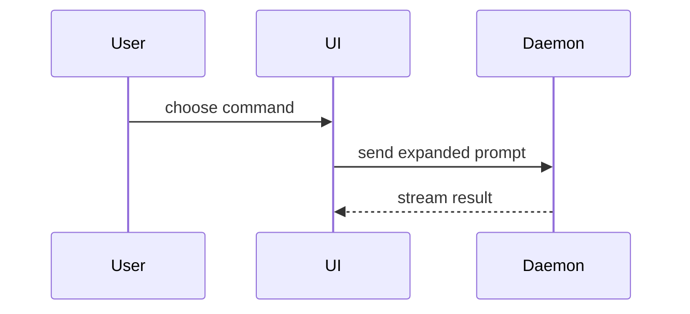

Fire this the moment an agent message doesn't land: jargon you don't follow, a decision whose premise you never saw, work you watched happen but can't picture. Re-pitch the confusing thing visually instead of repeating it in words. Skip the preamble and keep prose brief. Use the user's domain language from `CONTEXT.md`.

## The report

Four parts, in order. Leave out any part with nothing to say. For a confusing message with no work behind it, part 1 alone is the whole re-pitch.

1. **What was meant.** The confusing point restated as one smallest visual (pick from the catalog below), next to one or two sentences of plain explanation. If it was work, show what changed; if it was words, show what they describe.
2. **The code, if any.** When code changed, show the snippet: the before/after diff or the new block, trimmed to the lines that matter.
3. **Follow-ups needed.** Anything required before this is truly done: tests to run, things to check, input needed from the user. Copyable commands where they apply.
4. **Next task.** The single next step, stated as one line.

## Visual catalog

Adapted from `show-me`; see [`CREDITS.md`](./CREDITS.md). Pick the smallest view that makes the key point clear. You may use several; it is unlikely you will use all of them.

- Logic or an algorithm as pseudocode:

```text
on(save)
  if content is unchanged
    return cached result
  write new content
  return fresh result
```

- Runtime control flow as a call tree:

```text
submitForm
  createSession
    persistPrompt
    launchAgent
  navigateToSession
```

- UI structure as a component tree, with the state and module boundaries that matter:

```tsx
<SessionPage> (path/to/session.tsx)
  useSessionEvents()
  <SessionToolbar>
    <RunSkillButton>
```

- File responsibility or a broad refactor as a shallow file tree:

```text
src/
├── commands/       # parses user actions
├── sessions/       # owns session state
└── transport/      # sends API requests
```

- Component interaction, control flow, or data flow with Mermaid:



- What changes, when the surrounding shape already exists, as a `diff`. Match the diff shape to the topic: component diff for UI, file-tree diff for layout, call-tree diff for flow, pseudocode diff for state.

- The whole block when most of it is new, when omitted context would hide ownership or order, or when the user needs a copyable target shape.

## Rules

- Re-pitch, don't repeat. Never restate the same confusing words louder; translate them into a visual plus plain sentences.
- Answer "what was meant or done", never "what could be done". Report only words that were said or work that actually landed.
- One visual per point. A report with no pushback needed is a report that shows, not tells.
- Keep only the calls, files, props, states, and boundaries needed to answer what changed. Cut the rest.
