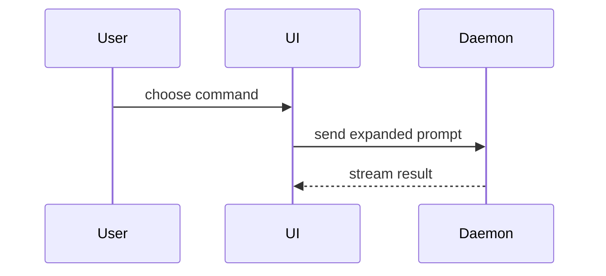

The user just watched work happen and wants to know what it was: what changed, what it looks like now, and how to check it. Report the work back visually. Skip the preamble and keep prose brief. Use the user's domain language from `CONTEXT.md`.

## The report

Four parts, in order. Leave out any part with nothing to say.

1. **What changed.** One smallest visual that makes the key point clear (pick from the catalog below). Place it next to one or two sentences of plain explanation.
2. **Before and after.** Concrete evidence the change works: the failing-then-passing test, the output diff, or a screenshot pair. For UI changes use a before/after table; sizing and upload method: [`ATTACHMENTS.md`](../model-invoked/pr/ATTACHMENTS.md).
3. **How to verify.** The exact commands to re-run the proof (tests, typecheck, the page to open), copyable as-is.
4. **What's next.** What is done, what is deliberately left out, and what you need from the user, if anything.

## Visual catalog

Adapted from `show-me`; see [`CREDITS.md`](./CREDITS.md). Pick the smallest view that makes the key point clear. You may use several; it is unlikely you will use all of them.

- Logic or an algorithm as pseudocode:

```text
on(save)
  if content is unchanged
    return cached result
  write new content
  return fresh result
```

- Runtime control flow as a call tree:

```text
submitForm
  createSession
    persistPrompt
    launchAgent
  navigateToSession
```

- UI structure as a component tree, with the state and module boundaries that matter:

```tsx
<SessionPage> (path/to/session.tsx)
  useSessionEvents()
  <SessionToolbar>
    <RunSkillButton>
```

- File responsibility or a broad refactor as a shallow file tree:

```text
src/
├── commands/       # parses user actions
├── sessions/       # owns session state
└── transport/      # sends API requests
```

- Component interaction, control flow, or data flow with Mermaid:



- What changes, when the surrounding shape already exists, as a `diff`. Match the diff shape to the topic: component diff for UI, file-tree diff for layout, call-tree diff for flow, pseudocode diff for state.

- The whole block when most of it is new, when omitted context would hide ownership or order, or when the user needs a copyable target shape.

## Rules

- Answer "what did you just do", never "what could be done". Report only work that actually landed.
- One visual per point. A report with no pushback needed is a report that shows, not tells.
- Keep only the calls, files, props, states, and boundaries needed to answer what changed. Cut the rest.
